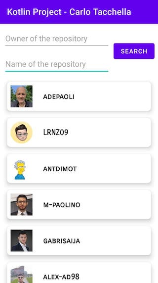

# Kotlin request API Project

This project is a Simple example of data request handling done by Carlo Tacchella.     

# Task   

Realizzare un’applicazione Android in Kotlin che permetta di visualizzare l’elenco degli stargazer di un repository su GitHub.       
Le funzionalità devono essere le seguenti:    
 - L’utente deve poter inserire proprietario e nome del repository    
 - In funzione di proprietario e nome del repository, l’applicazione mostrerà la lista degli stargazers    
 - Ciascun elemento della lista conterrà avatar e nome utente dello stargazer    

La documentazione dell'API GitHub per recuperare la lista degli stargazer è disponibile presso https://docs.github.com/en/rest/reference/activity#list-stargazers.

# Funzionalità aggiunte:
Seleziono il nome del stargazer e ho informazioni sul suo profilo in una finestra dedicata

# Librerie usate:
 - Gson    
 - OkHttp    
 - NavigationComponent

## WebService URL:    
https://www.monclergroup.com/wp-json/mobileApp/v1/getPressReleasesDocs    
Pay attention to the style, how you write the code.    
## Screenshots
## Screenshot 1

## Screenshot 2

## Screenshot 3
