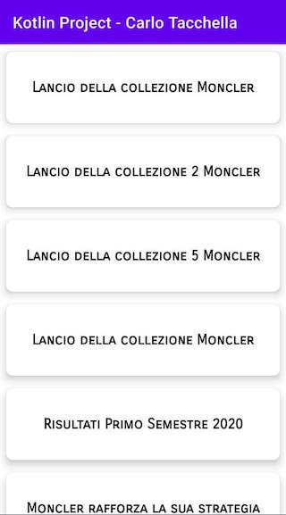
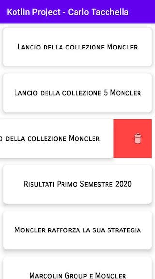
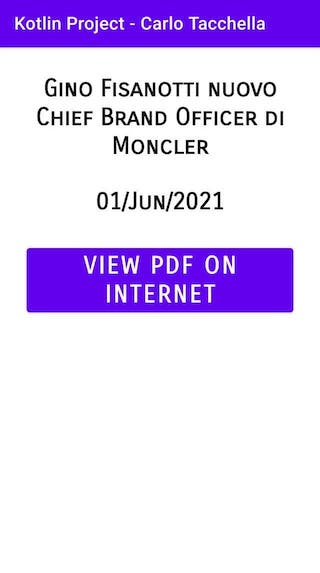

# Kotlin request API Project

This project is a Simple example of data request handling done by Carlo Tacchella.     

# Task   
- Define a master detail fragment structure.    
- Transition from master to detail should be animated (candidate could adopt his favourite approach).    
- Populate a recycler view with web service objects, each row should contain an object title.    
- The recycler view should support the swipe to delete and the pull to refresh.    
- When an item is selected, show the detail in another fragment with title, date, link and/or a preview of the document.    
- Create a data model to map the JSON Object from the web service.    
## UI/UX:    
- No specific graphic required, the candidate could adopt his favourite    
approach to solve the problem -Recommended libraries:    
- Gson    
- OkHttp    
- The use of libraries above is recommended but not mandatory -The use of the library NavigationComponent is mandatory.    
## WebService URL:    
https://www.monclergroup.com/wp-json/mobileApp/v1/getPressReleasesDocs    
Pay attention to the style, how you write the code.    
## Screenshots
## Screenshot 1

## Screenshot 2

## Screenshot 3
